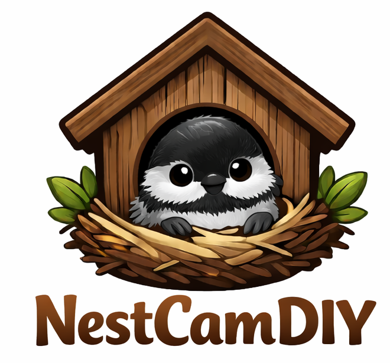
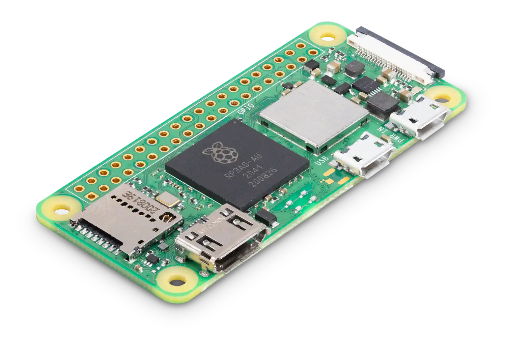
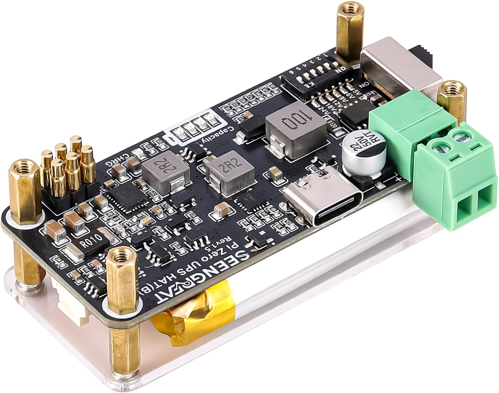
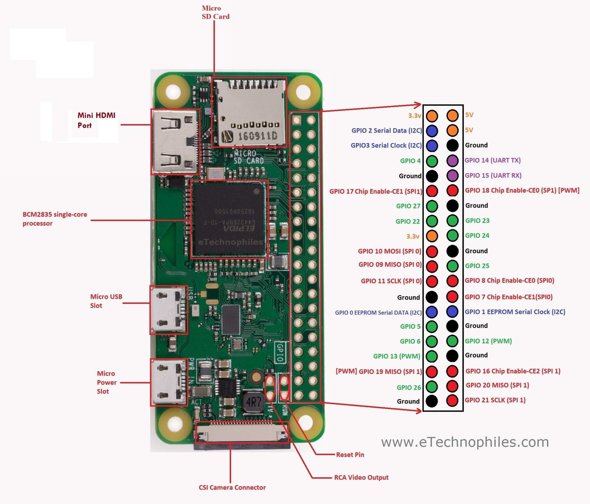
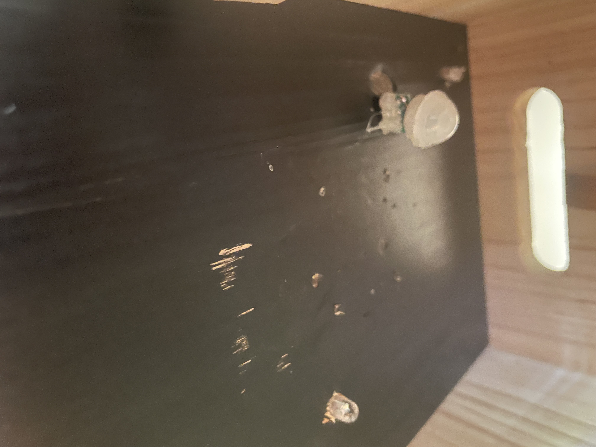
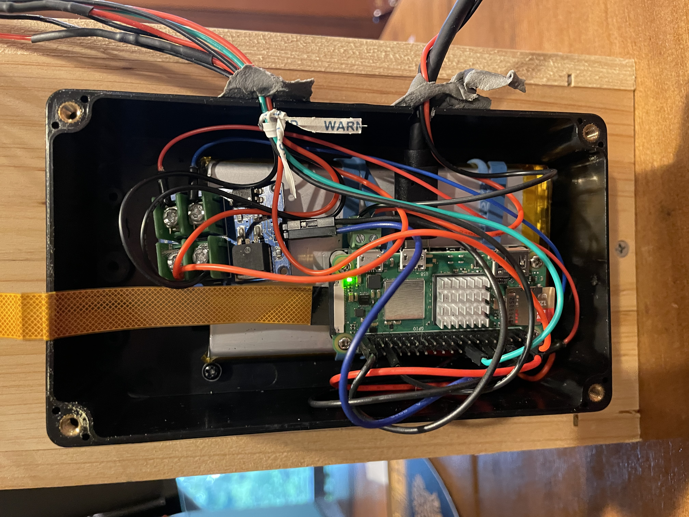
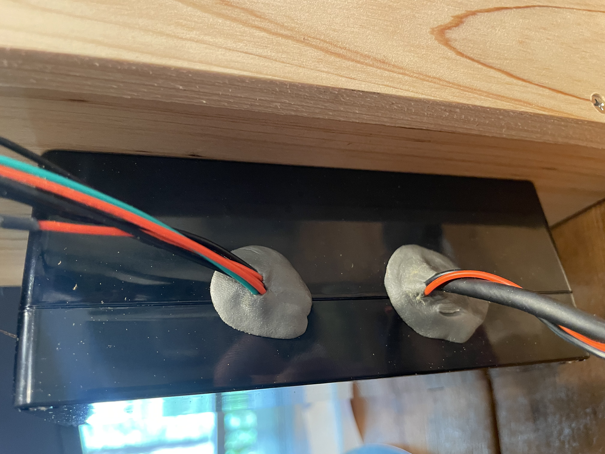
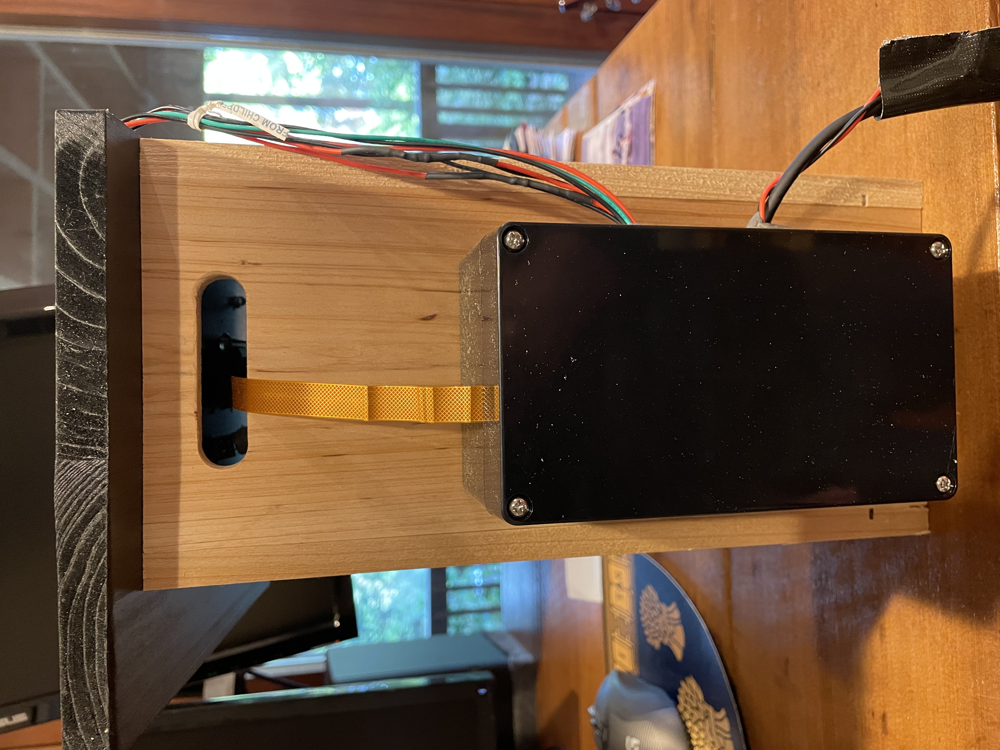

<p align="left">
  
</p>

<p align="left">
  An open-source, low-power wildlife camera for birdhouses and other small animal dwellings.
</p>

<p align="center">
  
</p>

<p align="center">
  <sub>Streaming video from inside the birdhouse.</sub>
</p>

<p align="center">
  
</p>

<p align="center">
  <sub>Can be powered by solar panels, batteries, or a USB.</sub>
</p>

## Introduction

NestCamDIY is a Raspberry Pi-based streaming video platform that can be installed in a birdhouse, squirrel house, or other animal dwelling. Depending on how you build it, it can be powered by a wired power supply, a battery, or solar power. It works in both ambient light and complete darkness and streams a video feed to an address on your network, so you can view it in any browser. This allows live viewing from your phone, a computer, or even a dedicated video monitor.

The interior of the box is illuminated by infrared lights, which are invisible to both birds and humans but still allow the image to show up clearly on video, although with distorted colors. It also incorporates a motion sensor that starts recording video whenever motion is detected. Recordings can then be downloaded and viewed via the web page.

These instructions are intended to allow you to build the NestCamDIY using inexpensive materials available on Amazon. You will need some basic skills in soldering, software, and, if you build your own birdbox, woodworking. This approach intentionally keeps soldering to a minimum, at the expense of some elegance in the design.

If you are willing to solder a bit more, you can create your own custom board to control the LEDs and motion detector. The downside of this approach is that it introduces additional failure points and can be difficult to debug unless you are proficient with a multimeter. The simplified setup below should work fine for most deployments.

## Important Caveats

> [!WARNING]
> This is intended for use on a private network and should not be exposed to the internet without additional security hardening.

> [!NOTE]
> Solar is an excellent way to power the NestCam, but you will need to select the right size solar panels and position them well enough to reliably power the system. That may take some tinkering and depends heavily on the time of year and your particular installation. If you just want to get it working, a wired power supply is the way to go.

## Power Considerations

The simplest power setup is just to plug it in. You can run an outdoor extension cord to the birdhouse, plug in an outdoor USB charger, and connect this to the device. Alternatively, you can use either a battery or a solar setup. Both involve using an uninterruptible power supply to power the device while you are swapping out the battery or when it is dark out.

You can leave a weatherproof battery somewhere convenient, such as at the base of the tree, and run a USB charging cord from it to the device. For solar, you will need to experiment to find a suitable solar panel size and location. In sunny locations this is easy, but it is more challenging in cloudy weather or at shaded sites. You will need a large enough solar array coupled with a good-size battery to get you through the night and less-than-ideal solar conditions.

## Cost 

Assuming you have the tools you'll need (soldering iron, wire strippers, a drill, etc.), the cost of the electronics should be on the order of $250. This does not include the birdhouse itself, any solar panels, or an external battery, since these vary based on your installation choices. Most of that cost is the camera, internal battery, and the Pi. 

## 1. Raspberry Pi Configuration

### 1.1 Download The Raspberry Pi Imager

Download the Raspberry Pi Imager here:

- <https://www.raspberrypi.com/software/>

You will need to insert a new micro-SD card into your computer using an SD card reader (some computers already have an SD-card reader. If not, buy one - see the Bill Of Materials for an example).

<details>
<summary><strong><em>Educational Background: What is a Raspberry Pi, and why are we using one?</em></strong></summary>

> A Raspberry Pi is a very small single-board computer: essentially a full Linux computer on one compact circuit board. It can boot from a microSD card, join your Wi-Fi network, run programs and services, and talk directly to hardware such as cameras, LEDs, and sensors through its onboard connectors and GPIO pins.
>
> That combination makes it a good fit for a project like this. The Pi Zero 2 W is small enough to hide in a compact enclosure, inexpensive enough for a hobby project, and powerful enough to handle the camera, motion-triggered recording, and simple web interface at the same time.
>
> Another reason to use a Raspberry Pi is the ecosystem around it. There is extensive documentation, a large community, official camera support, and many examples for troubleshooting. That matters a lot on a project like this, because you are not just building hardware — you are also assembling Linux, networking, imaging, and electronics into one system.
>
> If you want more background, start here:
>
> - [Raspberry Pi Documentation](https://www.raspberrypi.com/documentation/)
> - [Raspberry Pi on Wikipedia](https://en.wikipedia.org/wiki/Raspberry_Pi)

</details>

<p align="center">
  
</p>

### 1.2 Install Raspberry Pi OS

Install Raspberry Pi OS on your SD card following the instructions provided by the imager, using the options selected below:

- Select **Raspberry Pi Zero 2 W** as your device.
- Select the default full **Raspberry Pi OS (64-bit)** as your operating system. Testing with Lite and 32-bit systems did not yield meaningful power savings.
- Select the correct place to write the image. Be very careful here. You do **not** want to overwrite your hard drive or anything important! Check that the size shown matches the size of your SD card.
- Name your NestCam something easy to remember - you will use this name to view it on your web browser.
- Select your time zone and keyboard layout.
- Enter a username and password that you would like to use for the Pi.
- Enter the Wi-Fi network name and password that you would like the Pi to connect to. You can add additional networks later.
- Enable SSH. You can use either password or public-key authentication. Public-key authentication is more secure, but you will need to take an additional step. It is worth learning how to do this if you do not already know how, but if you are in a hurry, using a strong password is fine.
- Disable Raspberry Pi Connect.
- Double-check the selections and write the new image. This will take a minute or two.
- Once complete, remove the SD card.

<details>
<summary><strong><em>Educational Background: What is a public key, and why might you use one?</em></strong></summary>

> A public key is one half of a matched key pair used for public-key cryptography. You place the **public** half on the Raspberry Pi and keep the **private** half on your own computer. When you connect over SSH, the Pi can verify that your computer holds the matching private key without you sending that private key across the network.
>
> In practice, this usually feels simpler once it is set up. Instead of typing a password every time, your computer proves its identity automatically. It is also generally safer than password-only login, because an attacker cannot simply guess the private key the way they might try to guess a weak password.
>
> The important thing is that the private key must stay private. If someone gets a copy of it, they may be able to log in as you. That is why people often protect their private key with a passphrase and keep backups carefully. For a small home project this may sound formal, but it is a good habit and well worth learning.
>
> To create a key pair on your own computer, open a terminal and run:
>
> ```bash
> ssh-keygen -t ed25519 -C "your_email@example.com"
> ```
>
> Press Enter to accept the default save location unless you already use a different SSH key setup and know you want something else. You can then choose a passphrase or leave it blank. This will usually create a private key at `~/.ssh/id_ed25519` and a public key at `~/.ssh/id_ed25519.pub`.
>
> To display the public key so you can copy it, run:
>
> ```bash
> cat ~/.ssh/id_ed25519.pub
> ```
>
> Copy the contents of that `.pub` file into Raspberry Pi Imager when it asks for your public key, or later place it into the Pi user's `~/.ssh/authorized_keys` file.
>
> If you want more background, start here:
>
> - [Public-key cryptography on Wikipedia](https://en.wikipedia.org/wiki/Public-key_cryptography)
> - [Raspberry Pi documentation: remote access with SSH](https://www.raspberrypi.com/documentation/remote-access/)
> - [ssh-keygen manual page](https://man7.org/linux/man-pages/man1/ssh-keygen.1.html)

</details>

### 1.3 Install the Heat Sink and Header Pins

<em>Note that you can buy a Pi with the header pins and heat sink already installed. If you don't want to bother with soldering, you should go this route. Otherwise, read on.</em>

Put the adhesive heat sink that comes with the Raspberry Pi onto the black processor chip, not the silver-colored metal box, which is the Wi-Fi chip.

Next, solder header pins onto the Raspberry Pi.

- You will need two rows of 20 header pins.
- Use clamps to hold them in place so they remain vertical and not slanted.
- The plastic pieces of the pins should be on the top of the board.
- Inspect afterward for solder bridges or bad solder joints.

Be careful to ensure the solder joints are solid, since bad soldering can lead to major debugging headaches later. <em>Again, if you do not want to mess with this, you can buy a pre-soldered version of the Pi.</em>

### 1.3A <em>Solar and Battery Only: Install the UPS HAT</em>

The idea here is to use a UPS (Uninterruptible Power Supply) "hat" to the Raspberry Pi. This provides the Pi with both an interface for accepting solar power and also its own battery supply so you don't need to shut it down while switching your external batteries or when your solar panels are not generating enough power (such as during night). Attach the UPS hat using the standoff screws.

<p align="center">
  
</p>

<p align="center"><em>Seengreat Pi Zero UPS HAT (B) mounted on its battery.</em></p>

The size of the battery here is up to you. The bigger the battery, the more time you have between solar charging or between external battery swaps. The downside is it will require a larger enclosure. In general, 10,000 mAh is a good choice. That is the size battery indicated in the Bill of Materials. Because the system should draw more or less 1.1W, that (in theory) should give you about 30 hours of runtime.

<details>
<summary><strong><em>Educational Background: What is a watt, amp, and volt?</em></strong></summary>

> A **volt** is a measure of electrical potential difference. In plain English, it is the electrical “push” that drives charge through a circuit. An **amp** (or ampere) measures current, which is how much electric charge is flowing. A **watt** measures power, meaning how quickly electrical energy is being used.
>
> In simple direct-current systems like this one, the most useful relationship is:
>
> `watts = volts × amps`
>
> That is why these terms all show up in a project like NestCamDIY. The Pi and UPS HAT are powered at a particular voltage, the system draws some amount of current, and together those determine the total power draw. For example, if a 5-volt system is drawing 0.22 amps, it is using about 1.1 watts. Power is usually the easiest single number to think about when you are estimating battery life or deciding how large a solar panel needs to be.
>
> Each unit tells you something slightly different. **Volts** tell you whether the device is getting the electrical level it expects. **Amps** tell you how much current the system is pulling at that moment. **Watts** tell you the overall demand the system is placing on your power source. In this repository, `power_stats.py` reads voltage and shunt measurements from the INA219 on the UPS HAT and uses them to estimate current flow, charging state, and remaining battery life, which is exactly why these units matter in practice.
>
> You may also see battery capacity written in **mAh**, or milliamp-hours. That is a measure of stored charge, not the same thing as power. A bigger mAh number usually means longer runtime, but the real runtime still depends on voltage, efficiency losses, and how many watts the full NestCam system is actually consuming.
>
> If you want more background, start here:
>
> - [NIST: SI Units – Electric Current](https://www.nist.gov/pml/owm/si-units-electric-current)
> - [NIST: Ampere Introduction](https://www.nist.gov/si-redefinition/ampere-introduction)
> - [Watt on Wikipedia](https://en.wikipedia.org/wiki/Watt)

</details>

- Make sure the pogo pins on the HAT make good, clean contact with the bottom of the header pins on the Pi.
- Make sure the power switch is in the **off** position.
- Attach the battery to the HAT.
- Be extremely careful that the polarity is correct.
- Triple-check that the red wire on the battery leads to the `+` side of the battery connector on the HAT and the black wire leads to the `-` side.
- If you want to be extra careful, check the polarity with a multimeter.
- If you are using a larger battery than the one that comes with the UPS HAT (such as the 10,000 mAh option), which is recommended for solar, use rubber bands to securely strap the Pi/HAT assembly to the battery itself.

### 1.4 Insert the SD Card and Power the Pi

Insert the newly written SD card into the Pi.

- Wired: If building a wired NestCamDIY, plug the Pi into a wall charger using the **PWR USB** connection.
- Solar/Battery: If using solar or battery, plug the power cable into the **USB-C power connection** on the UPS HAT and switch the unit on.

### 1.5 Connect to the Pi and Install the Software

You should see a green LED light on the Pi light up and flicker a bit. Wait until it is steady green, then try to connect to the Pi over wifi using your computer. It could take a few minutes for the Pi to boot up the first time.

If you need instructions for installing a terminal on your computer, check out these links, depending on your operating system:
- **Windows:** [Install and get started with Windows Terminal](https://learn.microsoft.com/en-us/windows/terminal/install)
- **macOS:** [Open or quit Terminal on Mac](https://support.apple.com/guide/terminal/open-or-quit-terminal-apd5265185d-f365-44cb-8b09-71a064a42125/mac)
- **Linux:** [The Linux command line for beginners (Ubuntu documentation)](https://documentation.ubuntu.com/desktop/en/latest/tutorial/the-linux-command-line-for-beginners/)

Once your computer's terminal utility is working and you are connected to the same wifi network that the Pi is on, run:

```bash
ssh <NAME-OF-YOUR-PI>
```

This is the name you selected when you wrote the SD card, not your Wi-Fi network name or your username. Do not type the "<>" characters - just the plain name of your Pi.

<details>
<summary><strong><em>Educational Background: What are a terminal and SSH?</em></strong></summary>

> A terminal is a text-based way to control a computer by typing commands. Instead of clicking menus and icons, you tell the system exactly what to do with short instructions such as `cd`, `ls`, or `sudo shutdown -h now`. This can look unfamiliar at first, but it is often the clearest way to set up and troubleshoot a Linux device.
>
> SSH stands for **Secure Shell**. It lets you open a terminal session on another computer over the network in an encrypted way. In this project, that means you can sit at your regular laptop or desktop and control the Pi remotely without connecting a separate monitor, keyboard, or mouse to it.
>
> This is especially useful because the NestCam is meant to behave more like a small appliance than a desktop computer. Once it is installed, it may be in a tree, on a wall, or inside an enclosure. SSH is what lets you update the software, edit configuration files, run tests, and inspect logs without taking the whole thing apart.
>
> If you want more background, start here:
>
> - [Raspberry Pi documentation: remote access with SSH](https://www.raspberrypi.com/documentation/remote-access/)
> - [Command-line interface on Wikipedia](https://en.wikipedia.org/wiki/Command-line_interface)
> - [Terminal emulator on Wikipedia](https://en.wikipedia.org/wiki/Terminal_emulator)
> - [OpenSSH on Wikipedia](https://en.wikipedia.org/wiki/OpenSSH)

</details>

If that fails, you will need to troubleshoot why the Pi is not connecting to Wi-Fi. This is a common problem and there are ample materials written about it. Honestly, the easiest way to trouble shoot is just to describe the issue to ChatGPT and let it guide you through troubleshooting.

Once you have SSH access to the Pi:

1. Wait for it to finish any initial update tasks.
2. Run `top` and watch until CPU usage comes down to a percent or two, then hit `q` to exit.
3. Install Git:

   ```bash
   sudo apt install git
   ```

<details>
<summary><strong><em>Educational Background: What is git?</em></strong></summary>

> Git is a version-control system. It keeps track of changes to files over time, which makes it possible to download a project, see what has been changed, update it later, and collaborate without passing around loose copies of files. In a project like NestCamDIY, that matters because the software consists of many related files that need to stay in sync: Python scripts, service files, web files, test scripts, and configuration examples.
>
> When you run:
>
> ```bash
> git clone https://github.com/ehrenbrav/NestCamDIY
> ```
>
> you are telling Git to copy the entire repository from GitHub onto your Raspberry Pi. That gives you the project directory exactly as it is stored in the repository, including the installer, the daemon, the test scripts, and the example configuration files. Once it is cloned, you can move into that directory with `cd NestCamDIY` and run the installer from there.
>
> Git is also useful later if the project changes. You can return to the repository directory and use Git to inspect the current status, compare changes, or pull down updates from GitHub. For a beginner, though, the most important idea here is simple: Git is the tool that downloads the software project in an organized way instead of making you manually copy a bunch of individual files.
>
> If you want more background, start here:
>
> - [Git documentation](https://git-scm.com/doc)
> - [Git on Wikipedia](https://en.wikipedia.org/wiki/Git)
> - [GitHub Docs: About repositories](https://docs.github.com/en/repositories/creating-and-managing-repositories/about-repositories)

</details>

4. Clone the NestCamDIY repository:

   ```bash
   git clone https://github.com/ehrenbrav/NestCamDIY
   ```

5. Go into the project directory:

   ```bash
   cd NestCamDIY
   ```

6. Install the software so all the pieces are put in the correct places on your Pi:

   ```bash
   sudo python setup.py
   ```

   It might take a while to install all required dependencies since you are starting with a very bare-bones operating system.

7. Shut down the Pi for now until it is needed again:

   ```bash
   sudo shutdown -h now
   ```

<details>
<summary><strong><em>Educational Background: What is sudo?</em></strong></summary>

> `sudo` is a Linux command that means **"run this command as another user,"** and in everyday use that almost always means **run it as the superuser, or `root`.** The root account has permission to change system files, install software, manage services, write into protected directories, and shut the machine down. A normal user account usually cannot do those things directly.
>
> That is why this guide uses `sudo` for commands such as `sudo python setup.py` and `sudo shutdown -h now`. The setup script needs elevated privileges because it installs packages, writes configuration files into system locations, and registers background services so the NestCam can start automatically when the Pi boots. Shutting the system down also requires permission to control the operating system itself.
>
> You should use `sudo` carefully. It is useful because it lets you administer the Pi without logging in as root all the time, but it also means the command can make major changes if you type something incorrectly. In this project, that mostly means using it only for installation, service management, and other system-level tasks.

</details>

8. If you are using a UPS HAT, switch the on/off switch to **off** once the Pi LED shows the Pi is off. If you are using a wired setup, simply unplug the power supply once the LED turns off.

<details>
<summary><strong><em>Educational Background: How does the NestCamDIY software work?</em></strong></summary>

> In this repository, the main installer is [`setup.py`](https://github.com/ehrenbrav/nestcamDIY/blob/master/setup.py). It is not a normal Python packaging file; it is a system installer. It installs the required Debian packages, enables I2C support for the UPS monitoring hardware, copies the project files into standard system locations such as `/opt/nestcam`, writes the default configuration file to `/etc/nestcam/nestcam.env`, creates the recordings directory under `/var/lib/nestcam/recordings`, installs the systemd unit files, and enables the camera daemon and retention timer so they start automatically after boot.
>
> The main runtime program is [`services/nestcam_daemon.py`](https://github.com/ehrenbrav/nestcamDIY/blob/master/services/nestcam_daemon.py). This file talks to the Raspberry Pi camera through Picamera2, controls the infrared lights and motion sensor through the GPIO pins, and runs the small HTTP server that you interact with in the browser. That server provides the main page, the live MJPEG stream at `/stream.mjpg`, the status page at `/status.txt`, and the recordings interface, including viewing, downloading, and deleting saved clips. The daemon also tries to save power by starting the camera only when it is needed for live viewing or recording and stopping it again when the system is idle.
>
> Most day-to-day tuning happens in [`services/nestcam.env`](https://github.com/ehrenbrav/nestcamDIY/blob/master/services/nestcam.env), which is installed as `/etc/nestcam/nestcam.env`. That file contains settings for the web server address and port, optional HTTP Basic Authentication, the recordings directory, minimum free disk space, camera image controls such as frame rate, exposure, gain, and saturation, infrared LED settings such as brightness and PWM frequency, and motion-detection settings such as GPIO pin, pull direction, sample rate, debounce thresholds, minimum clip length, and cooldown time.
>
> Automatic cleanup of old videos is handled by [`services/retention.py`](https://github.com/ehrenbrav/nestcamDIY/blob/master/services/retention.py) together with [`services/nestcam-retention.service`](https://github.com/ehrenbrav/nestcamDIY/blob/master/services/nestcam-retention.service) and [`services/nestcam-retention.timer`](https://github.com/ehrenbrav/nestcamDIY/blob/master/services/nestcam-retention.timer). The retention script prunes the oldest recordings when the recordings directory grows too large or when the filesystem falls below a minimum free-space threshold. The timer runs that cleanup job automatically on a schedule so the device is less likely to fill the storage and stop saving recordings.
>
> The systemd unit [`services/nestcam.service`](https://github.com/ehrenbrav/nestcamDIY/blob/master/services/nestcam.service) is what makes the camera behave like an appliance rather than a script you have to launch manually. It tells Linux how to start the daemon at boot, where to read the environment file, and how to restart the service if it exits unexpectedly. That is why commands such as `systemctl status nestcam.service` and `journalctl -u nestcam.service` are so useful for troubleshooting: they are inspecting the installed background service rather than just the source files in the repository.
>
> The repository also includes [`webpage/index.html`](https://github.com/ehrenbrav/nestcamDIY/blob/master/webpage/index.html) for the browser front end and small hardware test scripts such as [`tests/test_led.py`](https://github.com/ehrenbrav/nestcamDIY/blob/master/tests/test_led.py) and [`tests/test_motion.py`](https://github.com/ehrenbrav/nestcamDIY/blob/master/tests/test_motion.py). The web page is the landing page for live viewing, while the test scripts let you check the LED and motion-sensor wiring before you permanently mount everything. If you are using the UPS HAT, [`power_stats.py`](https://github.com/ehrenbrav/nestcamDIY/blob/master/power_stats.py) is the optional power-monitoring script that reads the INA219 and reports voltage, current, and power.

> The NestCamDIY software is set up to run as a background Linux service on the Raspberry Pi. When the Pi boots, the service starts automatically and manages the parts of the system that matter day to day: the camera, the motion sensor, the infrared lights, the local recordings, and the small web interface you use to view status or watch the stream.
>
> The setup script is there to turn the project from a loose collection of files into something that behaves like an installed appliance. It places files in the right system locations, installs required packages, creates or updates service files, and makes sure the software can start automatically in the background instead of only when you launch it by hand.
>
> At a higher level, you can think of the software as three layers. One layer talks to the hardware, especially the camera and GPIO-connected devices. Another layer handles logic such as when to stream, when to record, and how to react to motion events. The final layer exposes a simple browser-based interface so you can interact with the system from another device on your network.
>
> If you want more background, start here:
>
> - [systemd.service documentation](https://www.freedesktop.org/software/systemd/man/systemd.service.html)
> - [systemd.unit documentation](https://www.freedesktop.org/software/systemd/man/systemd.unit.html)
> - [Raspberry Pi camera software documentation](https://www.raspberrypi.com/documentation/computers/camera_software.html)

</details>

## 2. Build the Hardware

Now it is time to build the hardware. The Pi both powers and controls the LEDs and motion detector using the GPIO pins. The LEDs are switched on and off using a MOSFET module, and the motion detector is a pre-built AM312 PIR sensor.

<details>
<summary><strong><em>Educational Background: What are GPIO pins, and what is a MOSFET?</em></strong></summary>

> GPIO stands for **General-Purpose Input/Output**. These are software-controlled pins on the Raspberry Pi that can either read a signal from another device or send a signal out to control something. In this project, one GPIO pin reads the motion sensor, while another pin is used to control the infrared light circuit.
>
> GPIO pins are useful because they let the Pi interact with the physical world directly. A normal laptop usually cannot do that without extra hardware. A Pi, by contrast, can notice that a sensor changed state, turn something on or off, or send timed pulses for dimming and control.
>
> A MOSFET is a kind of electronic switch. The Pi's GPIO pins can only supply a small amount of current, which is not enough to power the LEDs safely by themselves. Instead, the GPIO pin sends a tiny control signal to the MOSFET, and the MOSFET switches the larger LED current on and off. This protects the Pi and lets a low-power control signal operate a higher-power load.
>
> If you want more background, start here:
>
> - [General-purpose input/output on Wikipedia](https://en.wikipedia.org/wiki/General-purpose_input/output)
> - [Raspberry Pi Documentation](https://www.raspberrypi.com/documentation/)
> - [MOSFET on Wikipedia](https://en.wikipedia.org/wiki/MOSFET)

</details>

### 2.1 Create the LED Pigtails

You will need:

- Two infrared LED pigtails
- One colored LED pigtail for testing

The procedure for all three is the same. Solder a red wire to the long lead of the LED and a black wire to the shorter lead. LEDs have a polarity, so it is essential that current flows in the correct direction.

For all three pigtails:

1. Cut long pieces of red and black wire. Leave more length than you think you need so the wires can run from the top of the birdhouse back to the enclosure. You can cut them to the ideal length later.
2. Strip about 1 centimeter of insulation from all ends of the wires using wire strippers.
3. Twist a 680-ohm resistor to the positive or negative lead of the LED.

   <details>
   <summary><strong><em>Educational Background: Why do we use a resistor here, and why 680 ohms?</em></strong></summary>

   > A resistor limits how much current flows through the LED. LEDs are not like ordinary pieces of wire: once they begin conducting, the current can rise very quickly if nothing in the circuit limits it. Without a resistor, you can easily overdrive the LED, shorten its life, or burn it out almost immediately.
   >
   > The reason you pick a resistor value at all is basic circuit math. The supply voltage is higher than the LED's forward voltage, so the extra voltage has to be dropped somewhere. The resistor provides that drop and sets the current to a safe level according to Ohm's law. That is why almost every simple LED circuit includes one.
   >
   > A value around 680 ohms is a conservative, beginner-friendly choice for a simple test LED pigtail like this. It keeps current low, reduces the chance of damaging parts, and is still bright enough for testing. It is not the only value that would work, but it is a safe and practical choice when the goal is reliability rather than squeezing out maximum brightness.
   >
   > If you want more background, start here:
   >
   > - [Resistor on Wikipedia](https://en.wikipedia.org/wiki/Resistor)
   > - [Ohm's law on Wikipedia](https://en.wikipedia.org/wiki/Ohm%27s_law)
   > - [SparkFun: Light-Emitting Diodes (LEDs)](https://learn.sparkfun.com/tutorials/light-emitting-diodes-leds/all)
   > - [Adafruit: Revisiting Resistors](https://learn.adafruit.com/all-about-leds/revisiting-resistors)

   </details>

4. Twist the stripped end of one wire around the other end of the resistor, and twist the other wire around the remaining LED lead.
5. Apply a small amount of solder to the three spliced areas so you have a secure electrical connection.
6. Cut a piece of heat-shrink tubing long enough to cover your splice.
7. Make sure the exposed conductor portions of the wires and leads cannot touch each other.
8. Use a blow dryer to gently heat the heat-shrink tubing until it contracts tightly around the splice.
9. Once you know the final length you need, cut the wires and strip about 1 centimeter of insulation from the ends.

### 2.2 Create the Motion Sensor Pigtail

Make a similar pigtail for the motion sensor.

You will need three wires:

- **yellow** for `3.3V`
- **black** for ground
- **green** for the motion signal

This sensor uses `3.3V` rather than the `5V` used with the LEDs, so yellow is used here to distinguish the lower-voltage supply.

<details>
<summary><strong><em>Educational Background: What do positive supply and ground mean?</em></strong></summary>

> The positive supply is the connection that provides electrical energy to a component. Ground is the reference point and return path that lets current flow back and complete the circuit. In a simple direct-current circuit, both are necessary: power goes out from the supply, through the device, and back through ground.
>
> In practical wiring, this is why polarity matters. Some parts, such as LEDs, sensors, and many electronic boards, expect the positive and ground connections to be attached the right way around. If they are reversed, the part may fail to work, give nonsense readings, or in some cases be damaged.
>
> The word “ground” can be a little confusing because in electronics it does not always mean literal earth ground. Often it just means the common reference point shared by the parts of the circuit. For this project, the useful habit is simple: pay close attention to which wire is positive, which wire is ground, and make those connections consistently every time.
>
> If you want more background, start here:
>
> - [What Is Electricity? — SparkFun Learn](https://learn.sparkfun.com/tutorials/what-is-electricity/all)
> - [Electrical polarity on Wikipedia](https://en.wikipedia.org/wiki/Electrical_polarity)
> - [Ground (electricity) on Wikipedia](https://en.wikipedia.org/wiki/Ground_%28electricity%29)
> - [Polarity — SparkFun Learn](https://learn.sparkfun.com/tutorials/polarity/all)

</details>

There are two ways to do this: either use pre-made jumper wires or build your own. The best approach is to make your own 3-wire cable to connect directly to the motion sensor.

- Use Dupont crimpers and JST connectors so no soldering is required.
- This gives you a secure connector that can be attached and reattached at exactly the length you need.
- Tutorial on using these connectors: [Pololu video tutorial on working with custom cables and connectors](https://www.pololu.com/blog/196/video-tutorial-working-with-custom-cables-and-connectors)

Alternatively, you can buy pre-made jumper wires. You will need both female-female and male-female jumper wires. Just connect them together until you have the length you need.

### 2.3 Connect the Colored Test LED to the MOSFET Board

Connect the colored test LED pigtail to the MOSFET board.

- Loosen all four wire terminal screws.
- On the **load side** of the board, the side where the arrow is pointing, connect:
  - the **red** wire to the `+` terminal
  - the **black** wire to the `-` terminal

### 2.4 Connect Everything to the Pi

Use this Raspberry Pi Zero 2 W pinout image for reference. Be very careful here, since it is easy to connect things to the wrong pins. Note that the pin number is actually different than the GPIO number. The pin numbers run from 1 to 20, right to left and top to bottom. The GPIO numbers are defined in the software, so you Pin 3 for example is GPIO 2. 

<p align="center">
  
</p>

Make the following connections:

- Connect the yellow `3.3V` power supply for the motion detector to **Pin 1**.
- Connect the black ground for the motion detector to **Pin 6**. Any ground pin will work.
- Leave the green sensor wire unconnected for now.
- Connect a red jumper wire to the `+5V` **Pin 2** of the Pi.
- Connect the other end of this wire to the MOSFET board `+` power-supply terminal on the supply side.
- Connect a black jumper wire to **Ground Pin 20** of the Pi.
- Connect the other end to the MOSFET board `-` power-supply terminal on the supply side.
- Connect a blue jumper wire to **Pin 12**, which is `GPIO18`. This is the control used to turn the LEDs off and on and to dim them.
- Connect the other end of this wire to the `+` control pin of the MOSFET board.
- Connect a black ground jumper wire to **Pin 14** of the Pi.
- Connect the other end to the `-` control pin of the MOSFET board.

At this point, you should have the following wiring:

```text
Pin 1   (3.3V)   -> Yellow -> Motion detector + pin
Pin 2   (5V)     -> Red    -> MOSFET power supply + screw terminal (power supply side)
Pin 6   (GND)    -> Black  -> Motion detector - pin
Pin 12  (GPIO18) -> Blue   -> MOSFET + control pin
Pin 14  (GND)    -> Black  -> MOSFET - control pin
Pin 16  (GPIO23) -> Green  -> Motion detector signal pin (unconnected for testing)
Pin 18  (GPIO24) -> Orange -> (Optional - comes later) IR filter enable/disable on Waveshare camera
Pin 20  (GND)    -> Black  -> MOSFET power supply - screw terminal (power supply side)
```

The red and black LED wires should be attached to the `+` and `-` screw terminals, respectively, on the load side of the MOSFET board.

### 2.4A <em>Solar Setups Only: Create a Solar Power Cable</em>

For solar setups, create a solar power cable.

1. Cut a 1-foot length of black and red wire.
2. Strip about 1 centimeter off each end.
3. The UPS HAT comes with a separate plastic connector for the solar hookup. Plug this into the jack on the UPS HAT and carefully note which side is `+` and which is `-`.
4. Using a precision screwdriver, loosen each of the two screws in this connector.
5. Insert the red wire into the `+` side and the black wire into the `-` side, then retighten the screws.
6. Make sure the wires are securely clamped.
7. Thread the two wires through heat-shrink tubing.
8. Splice the other ends of the wires to a pre-made JST connector by braiding the wires together, tinning them with a bit of solder, and applying heat-shrink tubing to protect the connection.

Alternatively, you could use Dupont connectors to make your own custom-length wires.

## 3. Bench Testing

Now it is time to run some initial tests to ensure the connections are good and the various pieces are working properly.

### 3.1 Connect the Camera

On the Pi, use your fingernail to carefully push both sides of the tiny black plastic connector bar straight out from the Pi. It should slide out about 1 millimeter. Be gentle, since you do not want to break this piece.

- The ribbon cable that came attached to your camera might be the wrong size for the Pi. The one listed in the Bill of Materials is the correct one.
- Insert the ribbon cable with the metal contact strips facing the Pi. Be careful here - the contact strips need to be touching the contact points on the Pi...otherwise it will not work and this is an easy mistake to make.
- With the ribbon cable fully inserted, slide the black connector bar back into place.
- The ribbon cable should then feel securely connected and should not pull out easily.
- Repeat the same process on the camera side.
- On the camera side as well, the metal contact strips should face the board.
- If you are using the Waveshare camera, you additionally need to connect a wire to control the IR filter.
-- If you are making your own JST connectors, cut a piece of orange wire long enough to reach from the camera to the Pi header pins. Strip both ends. Thread one end through the "GPIO" hole in the Waveshare camera, so that the wire comes out of the front of the board, on the same side as the camera. Solder this to the board. Connect a female socket to the other end and attach to Pin 18 of the Pi.
-- If you are using pre-made jumper wires, put the pin of an orange wire through the "GPIO" hole in the Waveshare board so that the wire comes out of the front (camera-side) of the board. Solder this to the board. Connect the other end to Pin 18 of the Pi.

### 3.2 Boot the Pi

Boot the Pi by doing one of the following:

- If using the UPS HAT, turn the switch to **on**.
- If building a wired setup, plug a USB power charger into the **PWR** jack.

Wait for the green LED to come on and stop flashing. This may take a minute or two.

### 3.3 Run the LED and Motion Sensor Tests

Connect to the Pi over SSH as before:

```bash
ssh <NAME-OF-YOUR-PI>
```

Then go to the test directory:

```bash
cd test
```

Run the basic LED test:

```bash
./test_led.py
```

You should see the colored LED turn on and then turn off again.

Then:

1. Unplug the LED pigtail from the `LED1` connection.
2. Plug it into the `LED2` connection, again being careful about polarity.
3. Run the same test again:

   ```bash
   ./test_led.py
   ```

You should see the same behavior.

If either test fails, something is wrong. Most likely:

- The patch wires are connected to the wrong Pi pins, or
- There is a mistake in the control-board wiring

Next, run the motion sensor test:

```bash
./test_motion.py
```

Wave your hand in front of the motion sensor. The LED should light up. If you stay still, the LED should go out again. Once you have verified that it works, hit `Ctrl-C` to stop the test.

If the motion test fails, check both the pin wiring and the control-board wiring.

<details>
<summary><strong><em>Educational Background: What do commands like <code>./</code>, <code>cd</code>, <code>sudo</code>, and <code>Ctrl-C</code> mean?</em></strong></summary>

> These are small pieces of everyday Linux command-line vocabulary. `cd` means "change directory" - it changes your current folder, so `cd test` moves you into the `test` directory. `./something` means “run the program named `something` that is located in the current folder.” That leading `./` matters because Linux does not normally search the current folder automatically when you type a command.
>
> `Ctrl-C` is a keyboard shortcut used to stop a running command in the terminal. Under the hood, it usually sends an interrupt signal to the foreground program. That is why it is useful for test scripts: you can let them run while you observe the hardware, then press `Ctrl-C` when you are done instead of closing the terminal window abruptly.
>
> If you want more background, start here:
>
> - [Bash Reference Manual](https://www.gnu.org/software/bash/manual/bash.html)
> - [Bash builtins documentation](https://www.gnu.org/s/bash/manual/html_node/Bash-Builtins.html)
> - [GNU Coreutils manual](https://www.gnu.org/software/coreutils/manual/coreutils.html)
> - [signal(7) Linux manual page](https://man7.org/linux/man-pages/man7/signal.7.html)

</details>

### 3.4 Test the Camera

Run:

```bash
./test_camera.py
```

If the test fails, check the ribbon cable connection, especially that it is securely attached on each end and that the metal contacts are facing into each board.

### 3.4A <em>Solar and Battery Setups: Test the UPS HAT</em>

If you are using a UPS HAT, run:

```bash
../power_stats.py
```

This should give you running statistics on the power usage of the Pi. If everything is connected correctly, you should see a constant power draw of maybe 1.1-1.5 watts. Use Ctrl-C to stop.

### 3.5 Power Down the Pi

Power down the Pi:

```bash
sudo shutdown -h now
```

Disconnect the colored test LED. From here on, use the two infrared LEDs.

After you have verified that all system components are functioning, move on to the next step.

## 4. Birdhouse Assembly

The choice of birdhouse, or other habitat, is up to you. The size, shape of the entrance, and especially the location of the habitat determine the types of animals you will attract and how successful the setup will be.

You can either buy an off-the-shelf birdhouse or build your own. If you buy one, make sure it is large enough to accommodate the camera, motion sensor, and LEDs. You will need to attach the enclosure to the outside and drill holes for the LEDs, motion sensor, and ribbon cable.

See the example installation near the top of this README for a completed outdoor setup.

### 4.1 Attach the Electronics to the Enclosure

Stick one piece of Velcro onto the back of the Pi, or onto the battery if using a UPS HAT, and another piece onto the inside of the enclosure.

Figure out where you want the USB cable to run, remove the electronics, and two notches in the enclosure to accommodate the cables. 

One notch needs to accommodate:

- The motion sensor wires
- The two sets of LED wires

The other notch needs to accomodate:

- The USB power cable for the Pi
- The wires for the solar power, if using

A Dremel works really well for this, but a small hacksaw can also work.

### 4.2 Mount the Enclosure to the Birdhouse

There should be four small holes in the back of the enclosure. Use `#4` wood screws to attach the enclosure to the side of the birdhouse.

If the enclosure does not already have holes, drill your own.

If the enclosure comes with a weatherproofing gasket, the long squishy strip, push it into the groove around the edge of the enclosure to help ensure a watertight seal.

### 4.3 Place the Camera in the Birdhouse

Place the camera in the center of the roof so it gets a good image of the entire interior.

- Use pushpins to attach the camera to the roof.
- Run the ribbon cable through a small notch drilled in the wall on the same side as the enclosure.

### 4.4 Drill Holes for the LEDs and Motion Sensor

- Drill two holes for the infrared LEDs in the roof of the birdhouse.
- These should be on a diagonal, on either side of where the camera will go.
- Drill one larger hole for the motion sensor near one of the other corners.

### 4.5 Install the LEDs and Motion Sensor

Insert the LEDs into the first two holes.

- Let them protrude about 2 millimeters into the birdhouse so they provide good illumination.
- Temporarily secure the pigtails to the roof with duct tape once you are happy with their placement.

Then do the same with the motion sensor.

Run all three cables back to the enclosure.

<p align="center">
  
</p>

<p align="center"><em>Example interior view during assembly, showing the roof area and component placement inside the birdhouse.</em></p>

### 4.6 Put the Electronics Back Inside the Enclosure

Place the electronics back inside the enclosure. 

<p align="center">
  
</p>

<p align="center"><em>Rear enclosure open, showing the Pi, UPS HAT, wiring, and cable routing.</em></p>

### 4.7 Reconnect the Ribbon Cable

Connect the ribbon cable to the Pi as before, if it is not already connected.

### 4.8 Reconnect the Control Board

Connect the MOSFET board and motion detector board to the correct Pi pins as before using the colored wires.

### 4.9 Connect the Power Supply Cable

For wired power setups:

- Connect a 6-inch micro-USB extension cord into the **PWR** jack of the Pi

For battery and solar setups:

- Connect a 6-inch USB-C extension cord to the charging jack on the UPS HAT

In all cases:

- Route the cables through the notchs in the enclosure
- make sure there is some slack both inside and outside the enclosure

For solar setups, also attach the solar power cable you previously made and route it through one of the notches.

<p align="center">
  
</p>

<p align="center"><em>Example of wires routed through the enclosure and sealed with removable putty.</em></p>

<p align="center">
  
</p>

<p align="center"><em>Rear view with the enclosure closed and the ribbon cable and other wires routed along the side of the birdhouse.</em></p>

### 4.10 Test the System.

If your Pi is not already on, power it up by switching the power switch to "On" (if using a UPS Hat) or by connecting an external USB power (if using wired power). Watch for the green LED to light up and stop flickering.

Using a web browser on the same wifi network as the Pi, browse to "<NAME-OF-YOUR-PI>:8080". This is where the NestCamDIY stream is located. If you are using a custom port other than 8080, then use that number instead.

If you get a page not found error or see the web page but get a blank image, you'll need to troubleshoot. First, see if you can SSH into your Pi as before. Next, see if the nestcam service is running:

```
sudo systemctl status nestcam
```

If you see error messages here, something isn't working properly. The easiest way to debug this is, again, using ChatGPT. You can tell it too review the repository code, paste in the error message, and it should help you figure out what is going on. There are numerous reasons why it might not work: cameras that aren't automatically detected by the Pi, firewall settings, hardware faults, etc.

<details>
<summary><strong><em>Educational Background: What exactly is a URL and port?</em></strong></summary>

> A URL is the address you type into a browser to reach something on a network. In everyday use, people often think of it as the web address. In this project, when you type something like `http://nestcam:8080`, the `nestcam` part is the name of the Raspberry Pi on your local network, and the rest tells your browser how to connect to the web service running on it.
>
> A port is like a numbered doorway on that device. A single computer can run many network services at the same time, and the port number tells incoming traffic which one you want. For example, web traffic often uses port 80 by default, but the NestCamDIY software is configured to serve its web interface on port 8080, so you need to include `:8080` in the address unless you changed the configuration.
>
> That is why the README tells you to browse to `<NAME-OF-YOUR-PI>:8080`. You are not just identifying the Pi itself; you are also identifying the specific service on the Pi that provides the stream and status page. If you leave off the port, your browser will usually assume a default one instead, and it may fail to connect to the NestCam service.
>
> If you want more background, start here:
>
> - [URL on Wikipedia](https://en.wikipedia.org/wiki/URL)
> - [Port (computer networking) on Wikipedia](https://en.wikipedia.org/wiki/Port_(computer_networking))
> - [MDN Web Docs: What is a URL?](https://developer.mozilla.org/en-US/docs/Learn_web_development/Howto/Web_mechanics/What_is_a_URL)
> - [Cloudflare Learning Center: What is a network port?](https://www.cloudflare.com/learning/network-layer/what-is-a-computer-port/)

</details>

Once the streaming is working, make any adjustments to the camera to get the image right and test both with natural light and complete darkness (by puting a towel or something over the entire thing). The infrared LEDs should illuminate any time the camera is streaming or recording, so you should be able to see the interior of the birdhouse clearly even in complete darkness. Experiment with putting the LEDs lower or higher in the interior to get the best lighting. Also test the motion detection:

```
python tests/test_led.py --no-led-test
```

Check that moving your hand in and out of the birdbox triggers the motion detection. You may need to adjust the position of the motion sensor to optimize the detections.

### 4.11 Secure the LEDs and Motion Sensor

Once you are happy with the lighting and motion detection, permenantly secure the LEDs and motion sensor using hot glue. You will ideally not have anything bulging out of the roof of the birdhouse other than the wires themselves, so you can route these flat along the roof and into the enclosure. I use Gorilla Tape to weatherproof the LEDs, motion sensor, and wires, but you could also use a waterproof sealant, heat-shrink wrap or something else. I like having the wires running flat over the roof and down a corner of the birdbox into the enclosure.

### 4.12 Seal the Enclosure

Screw the enclosure shut and ensure that no water can get in. Use removable putty to waterproof the notches where the wires come out. At this point, the birdhouse should be complete and ready for installation in its final location.

## 5. Configuration

There are a number of settings you will need to modify, or may want to modify, to make your NestCamDIY work optimally. These will depend on the installation, especially the lighting, and on the type of camera you use.

In order to edit this file, you will need to use sudo (since it is in the protected /etc directory). If you don't know how to use a text editor using the command line and SSH, read some details below.

<details>
<summary><strong><em>Educational Background: Editing Text With the Linux Command Line</em></strong></summary>

> When you connect to the Raspberry Pi over SSH, you do not get a graphical desktop by default. That means you usually edit files using a text editor that runs directly inside the terminal. This may feel old-fashioned at first, but it is actually one of the most practical ways to manage a small Linux device that is meant to sit in a birdhouse or enclosure rather than on a desk with its own monitor and keyboard.
>
> The simplest editor for most beginners is usually `nano`. To edit the NestCam configuration file, for example, you can run:
>
> ```bash
> sudo nano /etc/nestcam/nestcam.env
> ```
>
> In `nano`, you can move around with the arrow keys and simply type to add or change text. The command list is shown at the bottom of the screen. `Ctrl-O` means **write out**, which saves the file, and `Ctrl-X` exits the editor. If you try to exit after changing something, `nano` will ask whether you want to save first. That is why `nano` is a good first editor for a project like this: it is simple, direct, and hard to get trapped in.
>
> A few other shortcuts are especially useful. `Ctrl-W` searches for text, `Ctrl-K` cuts the current line, and `Ctrl-U` pastes it back. Those are enough for most small edits to configuration files. If you make a mistake, you can usually just reopen the file and correct it. For this project, that is often all you need in order to change values in `nestcam.env`, adjust camera settings, or update service configuration.
> 
> You may also hear about `vim` or `vi`. These are powerful editors, but they have a steeper learning curve because they use different modes for typing text and issuing commands. They are worth learning eventually, but if your goal is just to get the NestCam running, `nano` is usually the easier place to start.
> 
> If you want more background, start here:
>
> - [GNU nano documentation](https://www.nano-editor.org/docs.php)
> - [Ubuntu tutorial: Editing files from the terminal](https://documentation.ubuntu.com/server/how-to/console/editing-files-with-nano/)
> - [Vim documentation](https://www.vim.org/docs.php)

</details>

The main configuration file for the installed system is `/etc/nestcam/nestcam.env`. The installer copies a sample version of this file into place, and the daemon reads it at startup. After you make changes, restart the service with `sudo systemctl restart nestcam.service` so the new settings take effect.

The first group of settings controls how you reach the camera over your network. `LIVE_BIND` determines which network interfaces the web server listens on, and `LIVE_PORT` determines the port number, which is why the README uses an address such as `<NAME-OF-YOUR-PI>:8080`. Optional `AUTH_ENABLED`, `LIVE_USER`, and `LIVE_PASS` settings can add simple HTTP Basic Authentication if you want a login prompt on your local network.

The next group controls recording behavior and storage. `RECORDINGS_ROOT` chooses where video clips are saved. `RECORDING_ENABLED` lets you disable clip recording entirely while still using live view. `MIN_FREE_GB` is a safety setting: if free disk space falls below that amount, the daemon will refuse to start a new recording rather than filling the storage completely.

For image quality, the most important settings are `FPS`, `AE_ENABLE`, `EXPOSURE_TIME`, `ANALOGUE_GAIN`, and `SATURATION`. `FPS` sets the target frame rate. Lower frame rates can improve night performance because they allow longer exposures, but they also make motion look less smooth. `AE_ENABLE=1` leaves exposure and gain on automatic control, which is usually the best starting point. If you set `AE_ENABLE=0`, then `EXPOSURE_TIME` and `ANALOGUE_GAIN` become manual controls. Longer exposure makes the image brighter but increases motion blur, while higher analogue gain also brightens the image but adds noise and grain. `SATURATION` controls color intensity. For infrared-only night scenes, a value near `0.0` can be helpful because it produces a grayscale image, which often looks cleaner than distorted IR color.

The infrared light settings determine how strongly the birdhouse is illuminated at night. `IR_GPIO` identifies the Pi pin used to control the lights, and `IR_ACTIVE_HIGH` tells the software whether a high signal or a low signal turns the lights on. `IR_BRIGHTNESS` lets you dim the LEDs from `0.0` to `1.0`, which is useful if the scene is overexposed or if you want to save some power. `IR_PWM_FREQUENCY` controls the dimming frequency. In general, you should leave the pin assignment and polarity alone unless your wiring is different from the README, but brightness is a very useful tuning control.

The motion-detection settings are the main tools for reducing false triggers. `MOTION_GPIO_PIN` selects the GPIO pin connected to the PIR sensor. `MOTION_ACTIVE_HIGH` and `MOTION_PULL` must match the way the sensor is wired so the input does not float. `SAMPLE_HZ` controls how often the PIR sensor is checked. `MOTION_TRIGGER_CONSECUTIVE_SAMPLES` says how many active readings in a row are required before motion is treated as real, and `MOTION_CLEAR_CONSECUTIVE_SAMPLES` says how many inactive readings are required before motion is treated as over. Increasing the trigger threshold usually reduces recordings of nothing, while keeping the clear threshold somewhat lower helps prevent rapid on-off flapping.

Three other motion settings shape the recorded clips. `MIN_CLIP_SECONDS` makes sure even a short motion event still produces a clip of usable length. `MOTION_COOLDOWN_SECONDS` keeps recording running briefly after motion stops so recordings do not end too abruptly when an animal pauses or moves intermittently. `MOTION_STARTUP_GRACE_SECONDS` ignores the PIR sensor for a short period after startup so the sensor has time to stabilize.

A good way to tune the system is to change only one or two variables at a time. For daytime image tuning, leave exposure on automatic first and test framing, focus, and general brightness. For night tuning, start by lowering `FPS`, then experiment with `SATURATION`, and only then move on to manual exposure and gain if needed. For motion tuning, begin by increasing `MOTION_TRIGGER_CONSECUTIVE_SAMPLES` or `MOTION_COOLDOWN_SECONDS` before making more aggressive changes.

## 6. Camera Choice

At this point, there are two camera options that make the most sense for this project:

- the **Arducam for Raspberry Pi Camera Module 3, 12MP IMX708 75° Autofocus NoIR Pi Camera V3**
- the **Waveshare IMX462 2MP IR-CUT Camera**

Both can work well with NestCamDIY because the infrared illumination in this project comes from **separate external IR LEDs** that are controlled by the Pi. That matters because it avoids a major power-budget problem seen on some other camera boards: built-in IR lights that switch on automatically and draw power whether you want them or not. With the two cameras discussed here, the IR lighting is under your control.

### Arducam Camera Module 3 NoIR (IMX708)

This is the simpler and more mainstream option. It offers much higher resolution than the Waveshare, autofocus, and a camera family that is already very familiar in the Raspberry Pi ecosystem. If you want the easiest path to a working image, the option to crop later, or the flexibility of autofocus in a small enclosure where camera placement may not be perfect, this is a strong choice.

The main drawback is that it is a **NoIR** camera, meaning it does not have an infrared-blocking filter. That makes it excellent for low-light and infrared use, but it also means daylight colors are less accurate. Under normal visible light, foliage and feathers can take on odd pinkish or purplish tones because the sensor is also seeing infrared that a normal daylight camera would block. If your main goal is simply to observe behavior and get a reliable image day and night, this may be perfectly acceptable. If you care a lot about natural-looking daytime plumage and nest appearance, it is a real downside.

### Waveshare IMX462 IR-CUT Camera

The Waveshare is the more specialized day-and-night option. It is a lower-resolution camera, but the IMX462 sensor is designed for strong low-light performance, and the board includes an **IR-cut filter** that can be switched for daytime or nighttime use. In practice, that means it can preserve more normal-looking daytime color while still working well with external infrared illumination at night.

The main tradeoffs are lower resolution, fixed focus rather than autofocus, and a somewhat more custom setup. The Pi may not auto-detect it without a configuration change, and if you want the system to switch the IR-cut filter automatically you may need to wire the filter-control pad to a GPIO and enable the matching software support. So while the Waveshare is a very good fit for the actual imaging problem in a birdhouse, it can require a bit more setup effort.

### How to Choose

For most birdhouse use, the most important question is not resolution but **what you care about most during the day**, because birds are usually most active in daylight.

Choose the **Waveshare IMX462** if:

- you want more natural-looking daytime color
- you want the best day/night balance from one camera
- you are willing to do a slightly more custom setup
- you are comfortable with 1080p resolution and fixed focus

Choose the **Arducam IMX708 NoIR** if:

- you want the simpler, more mainstream camera path
- you want autofocus and much higher resolution
- you may want to crop the image later
- you do not mind distorted daytime color

In other words, the Arducam is the easier and more flexible general-purpose camera, while the Waveshare is the better fit if you care more about correct daytime color and cleaner switching between normal daylight viewing and infrared night viewing.

A final point on power: because both of these options use **external IR LEDs** rather than built-in camera-mounted illuminators, both can fit a low-power NestCamDIY build. The key difference is not power draw from the camera itself, but whether you want the simplicity of the Arducam NoIR path or the better daytime color of the Waveshare IR-cut path.

### Waveshare IMX462 Configuration Change

With the Waveshare camera, you need to make the following changes to the configuration files for it to work.

Edit `/boot/firmware/config.txt` as follows:

- set `camera_auto_detect=0`
- add the line `dtoverlay=imx462`

Then save the file and reboot. Otherwise, the Pi will not automatically detect the camera.

## Adding Additional Wifi Networks

If you are building your system using a wifi network other than the one it will be deployed on, you'll absolutely need to add the additional wifi network to the Pi. Otherwise, you won't be able to access the Pi once you remove it from the wifi network you used to set it up!
Add the extra network or networks before you deploy the camera somewhere else. On current Raspberry Pi OS releases, Wi-Fi is managed by NetworkManager, so the easiest way to do this is with `nmcli` over SSH.

First, see what networks are visible:

```bash
sudo nmcli dev wifi list
```

Then add a normal password-protected network:

```bash
sudo nmcli dev wifi connect "YOUR-SSID" password "YOUR-WIFI-PASSWORD"
```

If the network is hidden, use:

```bash
sudo nmcli --ask dev wifi connect "YOUR-SSID" hidden yes
```

Repeat that for every network you want the Pi to remember. Once added, the connection is saved, so the Pi should reconnect automatically whenever it sees that network again.

To check what saved connections already exist, run:

```bash
nmcli connection show
```

If you accidentally entered something incorrectly, you can remove a saved Wi-Fi connection with:

```bash
sudo nmcli connection delete "YOUR-SSID"
```

A good practical approach is to add both your setup network and your final deployment network before you ever move the unit. That way, you can still reach the Pi in either location without having to take the enclosure apart or connect a monitor and keyboard.

## Updating the Software and Pi

The NestCamDIY is intended to stay running continuously. In normal use, you should leave it powered on and connected. When you want to update either the NestCamDIY software or the Raspberry Pi operating system, do it over SSH.

### Updating the NestCamDIY repository and reinstalling the software

Connect to the Pi over SSH and go to the project directory:

```bash
cd ~/NestCamDIY
```

Then pull down the latest version of the repository:

```bash
git pull
```

After that, run the installer again:

```bash
sudo python setup.py
```

This is important because `setup.py` does more than just install Python code. It also updates the files that are copied into system locations, such as the daemon, service files, web files, and configuration templates.

Once it finishes, restart the main service:

```bash
sudo systemctl restart nestcam.service
```

If you want to confirm that it came back up cleanly, run:

```bash
sudo systemctl status nestcam.service
```

### Updating the Raspberry Pi operating system

To update the operating system packages on the Pi, run:

```bash
sudo apt update
sudo apt full-upgrade
```

This updates the package lists and then installs the latest available package versions for the system. It may take a while. If the update installs a new kernel, firmware, camera stack, or other important system package, reboot the Pi afterward:

```bash
sudo reboot
```

After the Pi comes back up, reconnect over SSH and confirm that the NestCam service is running:

```bash
sudo systemctl status nestcam.service
```

If you updated both the operating system and the NestCamDIY repository, it is a good idea to run `sudo python setup.py` again after major system changes, especially if camera-related packages or service files may have changed.

## Powering off the Pi

This system is meant to stay powered on continuously, so you should not normally shut it down after everyday use. A shutdown is mainly for long-term storage, major hardware changes, or moving the unit somewhere that it will be disconnected from power.

To shut it down cleanly, connect over SSH and run:

```bash
sudo shutdown -h now
```

Wait for the Pi activity LED to stop and for the system to fully power down before disconnecting power.

- If you are using a wired setup, unplug the power supply only after the Pi has shut down.
- If you are using the UPS HAT, switch the HAT to **off** only after the Pi has shut down.

Avoid just pulling power without shutting down first unless there is no other option, because that can corrupt the microSD card or damage files.

## Solar Power Considerations

If you have a site with a reasonable amount of sunlight, you should be able to power the entire platform with one or two solar panels. The UPS hat is limited to 5W solar charging, so unfortunately even if you have enough sun to generate much more than that, the speed at which you can recharge the batter is capped at this level.

You can use the power_stats.py script to estimate the power draw of the unit - leave it running for a few minutes and test how streaming, recording, and using the infrared lights affects power draw. In my testing, it averaged at (very roughly speaking) 1.1W.

So in order to have it solely powered by solar, you'll need to cover this as well as charge up the battery for cloudy periods and nighttime. You will also want to add a buffer. So that works out to maybe 40 watt-hours of solar energy per day that you'll need to keep the system running reliably.

One future goal of the project is to improve both the power draw and the solar charging efficiency, so that is a focus of future development. This may require (i) migrating away from the UPS hat, since that is a big bottleneck for solar charging and (ii) migrating away from using the Pi entirely in favor of something lower powered.